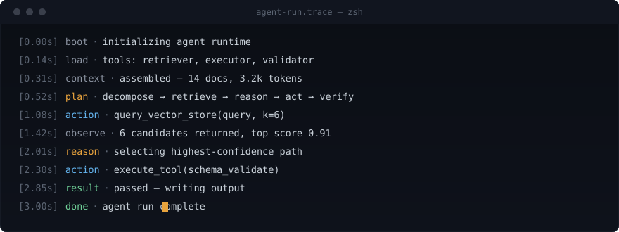

<div align="center">



</div>

<br/>

```
──────────────────────────────────────────────────────────────
$ cat about.md
──────────────────────────────────────────────────────────────
```

I build systems that reason, retrieve, and act — then make sure
they hold up under real data, real load, and real failure.

The trace above isn't decoration. It's roughly what a run
through one of my agents actually looks like.

```
──────────────────────────────────────────────────────────────
$ ls projects/
──────────────────────────────────────────────────────────────
```

**architecture-drift-guardian/**
&nbsp;&nbsp;↳ pairs static analysis with LLM reasoning to catch
&nbsp;&nbsp;&nbsp;&nbsp;architectural drift before it compounds into debt
&nbsp;&nbsp;↳ `python` `langgraph` `ast` `ci/cd`
&nbsp;&nbsp;↳ [→ open](https://github.com/YOUR_USERNAME/architecture-drift-guardian)

**domain-digital-twin/**
&nbsp;&nbsp;↳ a personalized memory system maintaining an evolving
&nbsp;&nbsp;&nbsp;&nbsp;model of user context for retrieval and reasoning
&nbsp;&nbsp;↳ `rag` `vector-search` `fastapi` `postgresql`
&nbsp;&nbsp;↳ [→ open](https://github.com/YOUR_USERNAME/domain-digital-twin)

**campus-digital-twin/**
&nbsp;&nbsp;↳ simulates campus resource use — space, energy, traffic —
&nbsp;&nbsp;&nbsp;&nbsp;to predict and optimize operations in near real time
&nbsp;&nbsp;↳ `time-series-ml` `simulation` `nextjs` `docker`
&nbsp;&nbsp;↳ [→ open](https://github.com/YOUR_USERNAME/campus-digital-twin)

**healthcare-document-intelligence/**
&nbsp;&nbsp;↳ extracts structured clinical findings from unstructured
&nbsp;&nbsp;&nbsp;&nbsp;medical records via transformer-based pipelines
&nbsp;&nbsp;↳ `transformers` `nlp` `aws`
&nbsp;&nbsp;↳ [→ open](https://github.com/YOUR_USERNAME/healthcare-document-intelligence)

```
──────────────────────────────────────────────────────────────
$ cat stack.txt
──────────────────────────────────────────────────────────────
```

frontend   react · next.js · typescript
backend    fastapi · node.js · postgresql
ai/ml      langgraph · transformers · rag
cloud      docker · aws · github actions

```
──────────────────────────────────────────────────────────────
$ tail -f status.log
──────────────────────────────────────────────────────────────
```

building    architecture-drift-guardian
learning    distributed systems for agentic pipelines
ask me      rag architecture, langgraph, prod ml infra
contact     YOUR_EMAIL · linkedin.com/in/YOUR_LINKEDIN

<br/>

<div align="center">

</div>
